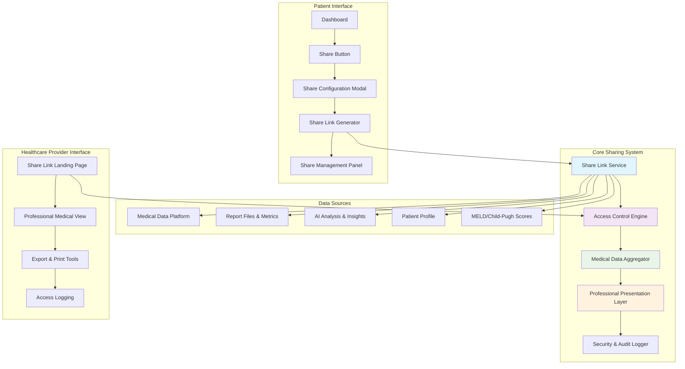

# Medical Report Sharing System - Design Document

## Overview

The Medical Report Sharing System creates secure, temporary, read-only links that provide comprehensive medical data without requiring authentication. This system transforms the existing liver tracking platform into a comprehensive medical communication tool by leveraging the existing medical data platform, consolidated reporting capabilities, and robust data processing infrastructure.

The system builds upon the existing `MedicalDataPlatform`, `consolidated-lab-report` functionality, and current database schema to create a seamless sharing experience that maintains the highest standards of medical data security and presentation.

## Architecture

### High-Level System Architecture



### Database Schema Extensions

Building on the existing Prisma schema, we'll add the following models:

```prisma
model ShareLink {
  id                String        @id @default(cuid())
  token             String        @unique // 32-character cryptographically secure token
  userId            String
  shareType         ShareType     // 'complete_profile' | 'specific_reports' | 'consultation_package'
  title             String
  description       String?
  
  // Content Selection
  reportIds         String[]      // Specific reports to include (empty = all)
  includeProfile    Boolean       @default(true)
  includeDashboard  Boolean       @default(true)
  includeScoring    Boolean       @default(true)
  includeAI         Boolean       @default(true)
  includeFiles      Boolean       @default(true)
  
  // Access Control
  expiresAt         DateTime
  maxViews          Int?          // Optional view limit
  currentViews      Int           @default(0)
  password          String?       // Optional bcrypt hashed password
  allowedEmails     String[]      // Specific healthcare provider emails
  
  // Status & Metadata
  isActive          Boolean       @default(true)
  createdAt         DateTime      @default(now())
  updatedAt         DateTime      @updatedAt
  lastAccessedAt    DateTime?
  
  // Relationships
  user              User          @relation(fields: [userId], references: [id], onDelete: Cascade)
  accessLogs        ShareAccess[]
  
  @@index([token])
  @@index([userId])
  @@index([expiresAt])
}

model ShareAccess {
  id              String    @id @default(cuid())
  shareLinkId     String
  ipAddress       String
  userAgent       String
  accessedAt      DateTime  @default(now())
  viewDuration    Int?      // Duration in seconds
  actionsPerformed Json?    // Track what was viewed/downloaded
  
  shareLink       ShareLink @relation(fields: [shareLinkId], references: [id], onDelete: Cascade)
  
  @@index([shareLinkId])
  @@index([accessedAt])
}

enum ShareType {
  COMPLETE_PROFILE
  SPECIFIC_REPORTS
  CONSULTATION_PACKAGE
}
```

## Components and Interfaces

### 1. Share Link Generation Service

**Location:** `src/lib/medical-sharing/share-link-service.ts`

```typescript
interface ShareLinkConfig {
  shareType: 'complete_profile' | 'specific_reports' | 'consultation_package';
  title: string;
  description?: string;
  reportIds?: string[];
  includeProfile: boolean;
  includeDashboard: boolean;
  includeScoring: boolean;
  includeAI: boolean;
  includeFiles: boolean;
  expiryDays: number;
  maxViews?: number;
  password?: string;
  allowedEmails?: string[];
}

interface ShareLinkResult {
  id: string;
  token: string;
  url: string;
  expiresAt: Date;
  qrCode?: string; // Base64 QR code for mobile sharing
}

class ShareLinkService {
  async createShareLink(userId: string, config: ShareLinkConfig): Promise<ShareLinkResult>
  async validateAccess(token: string, password?: string): Promise<ShareLinkValidation>
  async logAccess(token: string, accessInfo: AccessInfo): Promise<void>
  async revokeShareLink(userId: string, linkId: string): Promise<void>
  async getUserShareLinks(userId: string): Promise<ShareLink[]>
  async extendExpiry(userId: string, linkId: string, newExpiryDays: number): Promise<void>
}
```

### 2. Medical Data Aggregator

**Location:** `src/lib/medical-sharing/data-aggregator.ts`

Leverages the existing `MedicalDataPlatform` to compile comprehensive medical data:

```typescript
interface SharedMedicalData {
  patient: {
    id: string; // Anonymized
    demographics: PatientDemographics;
    profile: PatientProfile;
  };
  reports: {
    summary: ReportSummary;
    individual: MedicalReport[];
    trends: ChartSeries[];
  };
  scoring: {
    meld: MELDResult;
    childPugh: ChildPughResult;
    trends: ScoringTrends;
  };
  aiAnalysis: {
    insights: ClinicalInsight[];
    predictions: PredictiveAnalysis;
    recommendations: ClinicalRecommendation[];
  };
  files: {
    originalDocuments: FileReference[];
    processedImages: ProcessedImageData[];
  };
  metadata: {
    generatedAt: Date;
    dataRange: DateRange;
    shareToken: string;
    watermark: WatermarkData;
  };
}

class MedicalDataAggregator {
  async aggregateForSharing(
    userId: string, 
    shareConfig: ShareLinkConfig
  ): Promise<SharedMedicalData>
  
  async generateExecutiveSummary(data: SharedMedicalData): Promise<ExecutiveSummary>
  async applyDataMinimization(data: SharedMedicalData, shareType: ShareType): Promise<SharedMedicalData>
  async addWatermarking(data: SharedMedicalData, shareInfo: ShareLink): Promise<SharedMedicalData>
}
```

### 3. Professional Medical Presentation Layer

**Location:** `src/components/medical-sharing/professional-medical-view.tsx`

```typescript
interface ProfessionalMedicalViewProps {
  shareToken: string;
  medicalData: SharedMedicalData;
  accessInfo: ShareAccessInfo;
}

// Main professional interface optimized for healthcare providers
const ProfessionalMedicalView: React.FC<ProfessionalMedicalViewProps> = ({
  shareToken,
  medicalData,
  accessInfo
}) => {
  return (
    <div className="professional-medical-interface">
      <MedicalHeader 
        patient={medicalData.patient}
        shareInfo={accessInfo}
        watermark={medicalData.metadata.watermark}
      />
      
      <ExecutiveSummaryPanel summary={medicalData.executiveSummary} />
      
      <TabbedMedicalContent>
        <LabResultsTab reports={medicalData.reports} />
        <TrendsAnalysisTab trends={medicalData.reports.trends} />
        <ScoringTab scoring={medicalData.scoring} />
        <AIInsightsTab analysis={medicalData.aiAnalysis} />
        <OriginalDocumentsTab files={medicalData.files} />
        <PatientProfileTab profile={medicalData.patient} />
      </TabbedMedicalContent>
      
      <ProfessionalToolbar 
        onExportPDF={() => handleExportPDF()}
        onPrint={() => handlePrint()}
        onDownloadData={() => handleDownloadData()}
      />
    </div>
  );
};
```

### 4. Share Management Interface

**Location:** `src/components/medical-sharing/share-management-panel.tsx`

```typescript
const ShareManagementPanel: React.FC<{ userId: string }> = ({ userId }) => {
  return (
    <div className="share-management-panel">
      <ShareLinkCreator onCreateLink={handleCreateLink} />
      <ActiveSharesList 
        shareLinks={activeLinks}
        onRevoke={handleRevoke}
        onExtend={handleExtend}
        onCopyLink={handleCopyLink}
      />
      <ShareAnalytics analytics={shareAnalytics} />
    </div>
  );
};
```

## Data Models

### Share Link Configuration Model

```typescript
interface ShareLinkConfiguration {
  // Basic Information
  shareType: 'complete_profile' | 'specific_reports' | 'consultation_package';
  title: string;
  description?: string;
  
  // Content Selection
  contentInclusion: {
    reports: {
      includeAll: boolean;
      specificReportIds: string[];
      includeLatestOnly: boolean;
      dateRange?: { start: Date; end: Date };
    };
    dashboard: {
      includeTrends: boolean;
      includeCharts: boolean;
      includeMetrics: boolean;
    };
    scoring: {
      includeMELD: boolean;
      includeChildPugh: boolean;
      includeTrends: boolean;
      includeCalculationDetails: boolean;
    };
    aiAnalysis: {
      includeInsights: boolean;
      includePredictions: boolean;
      includeRecommendations: boolean;
      confidenceThreshold: number;
    };
    files: {
      includeOriginalDocuments: boolean;
      includeProcessedImages: boolean;
      includeExtractedData: boolean;
    };
    profile: {
      includeBasicInfo: boolean;
      includeMedicalHistory: boolean;
      includeContactInfo: boolean;
      anonymizationLevel: 'none' | 'partial' | 'full';
    };
  };
  
  // Security & Access Control
  security: {
    expiryDate: Date;
    maxViews?: number;
    passwordProtection?: {
      enabled: boolean;
      password: string;
    };
    emailRestrictions?: {
      enabled: boolean;
      allowedEmails: string[];
    };
    ipRestrictions?: {
      enabled: boolean;
      allowedIPs: string[];
    };
  };
  
  // Presentation Options
  presentation: {
    theme: 'professional' | 'clinical' | 'patient-friendly';
    language: string;
    units: 'US' | 'International' | 'Mixed';
    includeWatermark: boolean;
    includeDisclaimer: boolean;
  };
}
```

### Professional Medical Data Model

```typescript
interface ProfessionalMedicalData {
  // Executive Summary (Always First)
  executiveSummary: {
    patientOverview: {
      age: number;
      gender: string;
      primaryDiagnosis: string;
      diagnosisDate: Date;
    };
    currentStatus: {
      latestMELDScore: number;
      meldTrend: 'improving' | 'stable' | 'declining';
      childPughClass: 'A' | 'B' | 'C';
      keyMetrics: KeyMetric[];
    };
    clinicalHighlights: {
      criticalValues: CriticalValue[];
      significantTrends: TrendAlert[];
      aiInsights: PrioritizedInsight[];
    };
    recommendations: {
      immediate: string[];
      followUp: string[];
      monitoring: string[];
    };
  };
  
  // Detailed Medical Data
  laboratoryData: {
    latestResults: LabResult[];
    historicalTrends: TrendData[];
    abnormalValues: AbnormalValue[];
    referenceRanges: ReferenceRange[];
  };
  
  clinicalScoring: {
    meld: {
      current: MELDResult;
      historical: MELDTrend[];
      components: MELDComponents;
    };
    childPugh: {
      current: ChildPughResult;
      historical: ChildPughTrend[];
      components: ChildPughComponents;
    };
  };
  
  aiAnalysis: {
    insights: ClinicalInsight[];
    predictions: {
      shortTerm: Prediction[];
      longTerm: Prediction[];
    };
    riskAssessment: RiskAssessment;
    recommendations: ClinicalRecommendation[];
  };
  
  supportingDocuments: {
    originalReports: DocumentReference[];
    processedImages: ProcessedImage[];
    extractionSummary: ExtractionSummary;
  };
}
```

## Error Handling

### Share Link Access Errors

```typescript
enum ShareLinkError {
  LINK_NOT_FOUND = 'LINK_NOT_FOUND',
  LINK_EXPIRED = 'LINK_EXPIRED',
  MAX_VIEWS_EXCEEDED = 'MAX_VIEWS_EXCEEDED',
  INVALID_PASSWORD = 'INVALID_PASSWORD',
  EMAIL_NOT_AUTHORIZED = 'EMAIL_NOT_AUTHORIZED',
  IP_NOT_AUTHORIZED = 'IP_NOT_AUTHORIZED',
  LINK_REVOKED = 'LINK_REVOKED',
  DATA_NOT_AVAILABLE = 'DATA_NOT_AVAILABLE'
}

class ShareLinkErrorHandler {
  static handleAccessError(error: ShareLinkError): ErrorResponse {
    switch (error) {
      case ShareLinkError.LINK_EXPIRED:
        return {
          message: "This medical report link has expired. Please request a new link from the patient.",
          action: "contact_patient",
          severity: "warning"
        };
      case ShareLinkError.MAX_VIEWS_EXCEEDED:
        return {
          message: "This link has reached its maximum view limit. Please contact the patient for a new link.",
          action: "contact_patient", 
          severity: "info"
        };
      // ... other error cases
    }
  }
}
```

### Data Aggregation Error Handling

```typescript
interface DataAggregationResult {
  success: boolean;
  data?: SharedMedicalData;
  partialData?: Partial<SharedMedicalData>;
  errors: DataError[];
  warnings: DataWarning[];
  fallbacksUsed: string[];
}

class DataAggregationErrorHandler {
  async handleMissingData(userId: string, missingDataTypes: string[]): Promise<FallbackData>
  async handleCorruptedData(userId: string, corruptedReports: string[]): Promise<CleanedData>
  async handleProcessingErrors(errors: ProcessingError[]): Promise<ErrorRecoveryPlan>
}
```

## Testing Strategy

### Unit Testing

1. **Share Link Service Tests**
   - Token generation and uniqueness
   - Access validation logic
   - Expiry handling
   - Password verification
   - Email authorization

2. **Data Aggregation Tests**
   - Medical data compilation
   - Data minimization
   - Watermarking application
   - Error handling and fallbacks

3. **Security Tests**
   - Token cryptographic strength
   - Access control enforcement
   - Audit logging accuracy
   - Data sanitization

### Integration Testing

1. **End-to-End Share Flow**
   - Patient creates share link
   - Healthcare provider accesses link
   - Data presentation accuracy
   - Access logging verification

2. **Medical Data Platform Integration**
   - Data retrieval from existing platform
   - Chart data generation
   - AI insights integration
   - File access and preview

3. **Database Integration**
   - Share link CRUD operations
   - Access log storage
   - Data consistency
   - Performance under load

### Security Testing

1. **Access Control Testing**
   - Unauthorized access attempts
   - Token manipulation attempts
   - Password brute force protection
   - Email spoofing protection

2. **Data Protection Testing**
   - Data leakage prevention
   - Watermarking integrity
   - Cache prevention
   - Screenshot protection

3. **Compliance Testing**
   - HIPAA compliance verification
   - Audit trail completeness
   - Data retention policies
   - Consent tracking

### Performance Testing

1. **Load Testing**
   - Concurrent share link access
   - Large medical data aggregation
   - File serving performance
   - Database query optimization

2. **Mobile Performance**
   - Mobile device rendering
   - Touch interface responsiveness
   - Data loading optimization
   - Offline capability testing

## Security Considerations

### Token Security

- **Cryptographically Secure Generation**: Use `crypto.randomBytes(32)` for token generation
- **Token Entropy**: 32-character tokens provide 256 bits of entropy
- **Token Storage**: Store hashed tokens in database, never plain text
- **Token Rotation**: Implement token refresh for long-term shares

### Access Control

- **Multi-Factor Authentication**: Optional email verification for sensitive shares
- **IP Whitelisting**: Optional IP restriction for institutional access
- **Rate Limiting**: Implement aggressive rate limiting on share endpoints
- **Session Management**: Track and limit concurrent access sessions

### Data Protection

- **Watermarking**: Embed patient name, date, and share token in all content
- **Cache Prevention**: Set appropriate HTTP headers to prevent caching
- **Screenshot Protection**: CSS and JavaScript techniques to discourage screenshots
- **Print Control**: Controlled printing with embedded watermarks

### Audit and Compliance

- **Comprehensive Logging**: Log all access attempts, successful and failed
- **Data Retention**: Configurable retention periods for audit logs
- **Consent Tracking**: Record explicit patient consent for each share
- **Breach Detection**: Monitor for unusual access patterns

### Environment Configuration

```env
# Share Link Security
SHARE_LINK_DEFAULT_EXPIRY_DAYS=7
SHARE_LINK_MAX_EXPIRY_DAYS=30
SHARE_LINK_MAX_VIEWS_DEFAULT=10
SHARE_LINK_TOKEN_LENGTH=32
SHARE_LINK_REQUIRE_PASSWORD=false
SHARE_LINK_ALLOW_DOWNLOAD=true

# Rate Limiting
SHARE_LINK_RATE_LIMIT_PER_HOUR=10
SHARE_LINK_RATE_LIMIT_PER_DAY=50
SHARE_LINK_CREATION_RATE_LIMIT=5

# Security Features
SHARE_LINK_WATERMARK_ENABLED=true
SHARE_LINK_SCREENSHOT_PROTECTION=true
SHARE_LINK_CACHE_PREVENTION=true
SHARE_LINK_IP_LOGGING=true

# Compliance
SHARE_LINK_AUDIT_RETENTION_DAYS=2555  # 7 years
SHARE_LINK_CONSENT_REQUIRED=true
SHARE_LINK_HIPAA_MODE=true
SHARE_LINK_GDPR_MODE=true

# Performance
SHARE_LINK_DATA_CACHE_TTL=300  # 5 minutes
SHARE_LINK_MAX_CONCURRENT_VIEWS=100
SHARE_LINK_FILE_STREAMING=true
```

This design leverages your existing medical platform infrastructure while adding the critical sharing functionality that transforms your app into a comprehensive medical communication tool. The system maintains the highest security standards while providing an exceptional experience for both patients and healthcare providers.