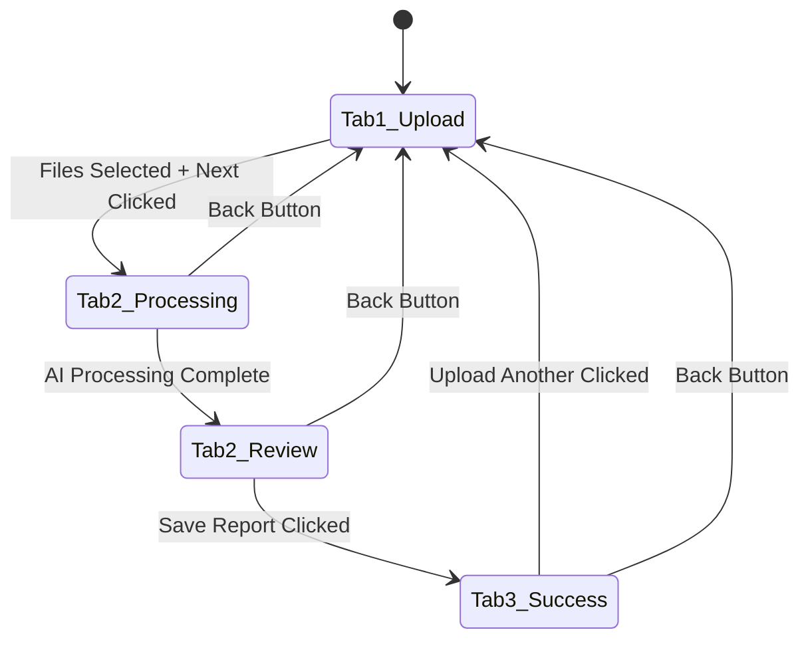

# Design Document

## Overview

This design transforms the existing single-screen medical uploader into a mobile-optimized, multi-step flow that guides users through upload, AI processing, review, and confirmation phases. The design leverages the existing medical design system while introducing a tab-based navigation pattern that provides clear progress indication and smooth transitions.

## Architecture

### Component Structure

The enhanced uploader will maintain the existing `MedicalUploader` component structure but introduce a state-driven tab system:

```typescript
interface UploadFlowState {
  currentTab: 1 | 2 | 3;
  uploadedFiles: File[];
  extractedData: ExtractionResult | null;
  isProcessing: boolean;
  isSaving: boolean;
  savedId: string | null;
  error: string | null;
}
```

### Tab Navigation System

The design implements a controlled tab system using the existing Radix UI tabs component with custom styling:

- **Tab 1**: Upload & Preview
- **Tab 2**: AI Processing & Review  
- **Tab 3**: Success & Confirmation

### State Management Flow



## Components and Interfaces

### Enhanced MedicalUploader Component

The main component will be restructured to use a tab-based layout:

```typescript
export function MedicalUploader() {
  const [flowState, setFlowState] = useState<UploadFlowState>({
    currentTab: 1,
    uploadedFiles: [],
    extractedData: null,
    isProcessing: false,
    isSaving: false,
    savedId: null,
    error: null
  });

  return (
    <div className="mobile-upload-flow">
      <ProgressIndicator currentStep={flowState.currentTab} />
      <Tabs value={`tab-${flowState.currentTab}`} className="w-full">
        <TabsContent value="tab-1">
          <UploadTab {...uploadTabProps} />
        </TabsContent>
        <TabsContent value="tab-2">
          <ProcessingReviewTab {...processingTabProps} />
        </TabsContent>
        <TabsContent value="tab-3">
          <SuccessTab {...successTabProps} />
        </TabsContent>
      </Tabs>
    </div>
  );
}
```

### Tab Components

#### 1. UploadTab Component
- Maintains existing upload button layout
- Enhanced file preview grid with delete functionality
- "Next" button that appears when files are selected
- Mobile-optimized touch targets

#### 2. ProcessingReviewTab Component
- Full-screen processing overlay during AI analysis
- Auto-transition to review form when processing completes
- Editable form fields for extracted data
- "Save Report" button with validation

#### 3. SuccessTab Component
- Success message with animation
- Summary of saved data
- "Upload Another" button to reset flow
- Manual confirmation required (no auto-return)

### Progress Indicator Component

```typescript
interface ProgressIndicatorProps {
  currentStep: 1 | 2 | 3;
}

function ProgressIndicator({ currentStep }: ProgressIndicatorProps) {
  const steps = [
    { number: 1, label: "Upload", icon: Upload },
    { number: 2, label: "Review", icon: Eye },
    { number: 3, label: "Success", icon: CheckCircle }
  ];

  return (
    <div className="progress-indicator">
      {steps.map((step, index) => (
        <ProgressStep 
          key={step.number}
          step={step}
          isActive={currentStep === step.number}
          isCompleted={currentStep > step.number}
          isLast={index === steps.length - 1}
        />
      ))}
    </div>
  );
}
```

### Navigation Controls

#### Back Button Component
```typescript
function BackButton({ onBack, disabled }: BackButtonProps) {
  return (
    <Button
      variant="ghost"
      size="sm"
      onClick={onBack}
      disabled={disabled}
      className="back-button"
    >
      <ArrowLeft className="w-4 h-4 mr-2" />
      Back
    </Button>
  );
}
```

#### Next Button Component
```typescript
function NextButton({ onNext, disabled, loading }: NextButtonProps) {
  return (
    <Button
      onClick={onNext}
      disabled={disabled}
      className="next-button btn-primary"
    >
      {loading ? (
        <div className="flex items-center space-x-2">
          <div className="loading-spinner" />
          <span>Processing...</span>
        </div>
      ) : (
        <div className="flex items-center space-x-2">
          <span>Next</span>
          <ArrowRight className="w-4 h-4" />
        </div>
      )}
    </Button>
  );
}
```

## Data Models

### Enhanced Flow State
The existing state management will be enhanced to support the multi-step flow:

```typescript
interface UploadFlowState {
  // Navigation
  currentTab: 1 | 2 | 3;
  
  // File Management
  uploadedFiles: File[];
  filePreviewUrls: string[];
  
  // AI Processing
  isProcessing: boolean;
  processingProgress: number;
  
  // Data Review
  extractedData: ExtractionResult | null;
  editedData: ExtractionResult | null;
  
  // Saving
  isSaving: boolean;
  savedId: string | null;
  
  // Error Handling
  error: string | null;
  
  // UI State
  showProcessingOverlay: boolean;
  autoAdvanceEnabled: boolean;
}
```

### Processing Overlay State
```typescript
interface ProcessingOverlayState {
  isVisible: boolean;
  message: string;
  progress: number;
  canCancel: boolean;
}
```

## Error Handling

### Error Display Strategy
- **Tab 1**: File validation errors shown inline
- **Tab 2**: Processing errors with retry options
- **Tab 3**: Save errors with recovery options

### Error Recovery Patterns
```typescript
interface ErrorRecovery {
  type: 'file_validation' | 'processing' | 'save';
  message: string;
  actions: {
    retry?: () => void;
    goBack?: () => void;
    skip?: () => void;
  };
}
```

### Retry Mechanisms
- **File Upload**: Automatic retry with exponential backoff
- **AI Processing**: Manual retry with error details
- **Save Operation**: Automatic retry with user notification

## Testing Strategy

### Unit Testing
- **State Management**: Test all state transitions
- **Component Rendering**: Test each tab component independently
- **Navigation Logic**: Test tab switching and validation
- **Error Handling**: Test error states and recovery

### Integration Testing
- **Full Flow**: Test complete upload-to-success workflow
- **File Processing**: Test various file types and sizes
- **AI Integration**: Test extraction and review flow
- **Mobile Interactions**: Test touch gestures and responsive behavior

### E2E Testing
- **Mobile Devices**: Test on actual mobile devices
- **Cross-Browser**: Test on Safari, Chrome, Firefox mobile
- **Accessibility**: Test with screen readers and keyboard navigation
- **Performance**: Test with slow networks and large files

### Test Scenarios
```typescript
describe('Mobile Upload Flow', () => {
  test('completes full upload workflow', async () => {
    // Tab 1: Upload files
    await uploadFiles(['test-report.pdf']);
    await clickNext();
    
    // Tab 2: Process and review
    await waitForProcessing();
    await reviewExtractedData();
    await saveReport();
    
    // Tab 3: Success confirmation
    await verifySuccessMessage();
    await clickUploadAnother();
    
    // Verify return to Tab 1
    expect(getCurrentTab()).toBe(1);
  });

  test('handles processing errors gracefully', async () => {
    await uploadFiles(['corrupted-file.pdf']);
    await clickNext();
    await waitForError();
    await clickRetry();
    // Verify error handling and retry logic
  });

  test('supports mobile gestures', async () => {
    await uploadFiles(['test.jpg']);
    await swipeLeft(); // Should advance to next tab
    await swipeRight(); // Should go back
    // Verify gesture navigation
  });
});
```

## Mobile Optimizations

### Touch Interface Design
- **Button Sizes**: Minimum 44px touch targets
- **Spacing**: Adequate spacing between interactive elements
- **Gestures**: Swipe support for tab navigation
- **Haptic Feedback**: Vibration feedback for actions

### Responsive Layout
```css
.mobile-upload-flow {
  /* Mobile-first responsive design */
  @media (max-width: 768px) {
    .upload-options {
      grid-template-columns: 1fr;
      gap: var(--space-4);
    }
    
    .file-preview-grid {
      grid-template-columns: repeat(2, 1fr);
    }
    
    .progress-indicator {
      padding: var(--space-2);
    }
  }
}
```

### Performance Optimizations
- **Lazy Loading**: Load tab content only when needed
- **Image Optimization**: Compress preview images
- **State Persistence**: Save draft data to localStorage
- **Network Handling**: Graceful offline/online transitions

### Accessibility Features
- **Screen Reader Support**: Proper ARIA labels and descriptions
- **Keyboard Navigation**: Full keyboard accessibility
- **High Contrast**: Support for high contrast mode
- **Reduced Motion**: Respect prefers-reduced-motion settings

## Visual Design

### Animation System
```css
.tab-transition {
  transition: transform 300ms cubic-bezier(0.4, 0, 0.2, 1);
}

.slide-enter {
  transform: translateX(100%);
}

.slide-enter-active {
  transform: translateX(0);
}

.slide-exit {
  transform: translateX(0);
}

.slide-exit-active {
  transform: translateX(-100%);
}
```

### Processing Overlay Design
```css
.processing-overlay {
  position: fixed;
  top: 0;
  left: 0;
  right: 0;
  bottom: 0;
  background: rgba(255, 255, 255, 0.95);
  backdrop-filter: blur(8px);
  display: flex;
  flex-direction: column;
  align-items: center;
  justify-content: center;
  z-index: 1000;
}

.processing-message {
  font-size: var(--text-lg);
  font-weight: var(--font-semibold);
  color: var(--medical-neutral-900);
  text-align: center;
  margin-bottom: var(--space-6);
}

.processing-spinner {
  width: 64px;
  height: 64px;
  border: 4px solid var(--medical-primary-200);
  border-top: 4px solid var(--medical-primary-600);
  border-radius: 50%;
  animation: spin 1s linear infinite;
}
```

### Success Animation
```css
@keyframes success-bounce {
  0%, 20%, 53%, 80%, 100% {
    transform: translate3d(0, 0, 0);
  }
  40%, 43% {
    transform: translate3d(0, -30px, 0);
  }
  70% {
    transform: translate3d(0, -15px, 0);
  }
  90% {
    transform: translate3d(0, -4px, 0);
  }
}

.success-icon {
  animation: success-bounce 1s ease-in-out;
}
```

## Implementation Considerations

### Backward Compatibility
- Maintain existing API interfaces
- Preserve current file upload functionality
- Support existing extraction result format
- Ensure graceful degradation for older browsers

### Performance Metrics
- **Time to Interactive**: < 2 seconds on mobile
- **File Upload Speed**: Progress indication for files > 1MB
- **AI Processing Time**: Clear expectations and progress updates
- **Memory Usage**: Efficient file preview handling

### Security Considerations
- **File Validation**: Client and server-side validation
- **Upload Limits**: Enforce file size and type restrictions
- **Data Sanitization**: Clean extracted data before display
- **Error Information**: Avoid exposing sensitive error details

This design provides a comprehensive foundation for implementing the mobile-friendly upload flow while maintaining the existing functionality and medical design standards.