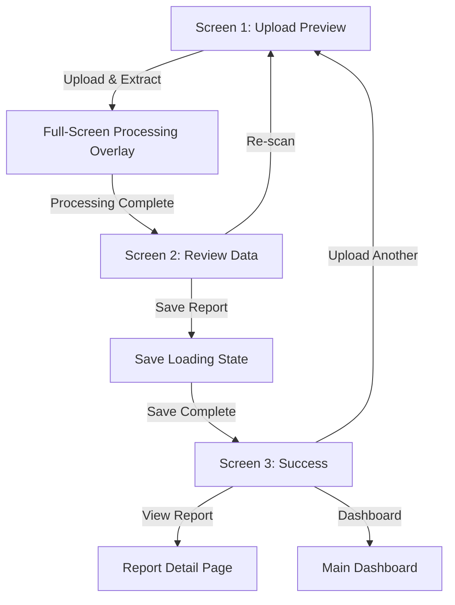

# Upload Flow UX Refinement - Design Document

## Overview

This design document outlines the specific changes needed to transform the current three-screen upload flow from a confusing navigation-based system to a clear, action-oriented user experience. The focus is on replacing generic buttons with specific, purpose-driven actions and enhancing loading states.

## Architecture

### Current vs. New Button Architecture

**Current (Problematic):**
```
Screen 1: [Next] → Generic navigation
Screen 2: [Back] [Next] → Generic navigation  
Screen 3: [Upload Another] → Specific action ✓
```

**New (Clear Purpose):**
```
Screen 1: [Upload & Extract] → Specific action
Screen 2: [Re-scan] [Save Report] → Specific actions
Screen 3: [View Report] [Upload Another] [Dashboard] → Specific actions
```

### Component Interaction Flow



## Components and Interfaces

### 1. Enhanced Upload Preview Tab

**File:** `web/src/components/upload-flow/upload-preview-tab.tsx`

**Changes Required:**
- Remove "Next" button completely
- Add "Upload & Extract" button with specific styling
- Implement immediate extraction trigger
- Add button state management (disabled/enabled/loading)

**New Button Interface:**
```typescript
interface UploadExtractButtonProps {
  hasFiles: boolean;
  isProcessing: boolean;
  onUploadAndExtract: () => void;
}
```

**Button States:**
- **Disabled**: No files selected (gray, not clickable)
- **Enabled**: Files selected (blue, clickable)
- **Loading**: Processing active (blue with spinner, disabled)

### 2. Enhanced Processing Review Tab

**File:** `web/src/components/upload-flow/processing-review-tab.tsx`

**Changes Required:**
- Remove generic navigation buttons
- Add specific action buttons: "Re-scan" and "Save Report"
- Implement button-specific loading states
- Add confirmation logic for re-scan action

**New Button Interface:**
```typescript
interface ReviewActionButtonsProps {
  onRescan: () => void;
  onSaveReport: () => void;
  isSaving: boolean;
  hasData: boolean;
}
```

**Button Behaviors:**
- **Re-scan**: Always enabled, shows confirmation dialog, clears data
- **Save Report**: Enabled when data exists, shows loading spinner when saving

### 3. Full-Screen Processing Overlay Enhancement

**File:** `web/src/components/upload-flow/processing-overlay.tsx`

**Current Issues:**
- Not truly full-screen
- Static text
- Basic loading indicator

**Enhancements Required:**
- True full-screen coverage (z-index: 9999)
- Dynamic text updates during processing
- Enhanced loading animation
- Cannot be dismissed during processing
- Accessibility improvements

**New Interface:**
```typescript
interface EnhancedProcessingOverlayProps {
  isVisible: boolean;
  stage: 'uploading' | 'extracting' | 'analyzing' | 'completing';
  progress?: number;
  onCancel?: () => void; // Only available in certain stages
}
```

### 4. Navigation Logic Updates

**File:** `web/src/components/upload-flow/upload-flow-tabs.tsx`

**Changes Required:**
- Remove generic `NextButton` and `BackButton` imports
- Remove `handleNext` and navigation logic
- Implement specific action handlers
- Update tab transition logic

**New Action Handlers:**
```typescript
interface UploadFlowActions {
  onUploadAndExtract: () => Promise<void>;
  onRescan: () => void;
  onSaveReport: () => Promise<void>;
  onViewReport: (id: string) => void;
  onUploadAnother: () => void;
  onGoToDashboard: () => void;
}
```

## Data Models

### Enhanced Flow State

**Current State Issues:**
- Generic navigation state
- Unclear processing stages
- Missing button-specific loading states

**Enhanced State Model:**
```typescript
interface EnhancedUploadFlowState {
  // Current screen
  currentScreen: 1 | 2 | 3;
  
  // File management
  uploadedFiles: File[];
  
  // Processing states
  isExtracting: boolean;
  extractionStage: 'uploading' | 'extracting' | 'analyzing' | 'completing';
  extractionProgress?: number;
  
  // Data states
  extractedData: any | null;
  
  // Action states
  isSaving: boolean;
  saveProgress?: number;
  
  // Success state
  savedReportId: string | null;
  
  // Error handling
  error: string | null;
  errorType: 'upload' | 'extraction' | 'save' | null;
}
```

### Button State Management

```typescript
interface ButtonState {
  enabled: boolean;
  loading: boolean;
  text: string;
  loadingText?: string;
  variant: 'primary' | 'secondary' | 'success' | 'danger';
}

interface ScreenButtonStates {
  screen1: {
    uploadAndExtract: ButtonState;
  };
  screen2: {
    rescan: ButtonState;
    saveReport: ButtonState;
  };
  screen3: {
    viewReport: ButtonState;
    uploadAnother: ButtonState;
    goToDashboard: ButtonState;
  };
}
```

## Error Handling

### Enhanced Error States

**Current Issues:**
- Generic error messages
- No recovery options
- Unclear error context

**Enhanced Error Handling:**

1. **Upload Errors**
   - File type validation
   - File size limits
   - Network connectivity issues
   - Clear recovery actions

2. **Extraction Errors**
   - Processing failures
   - Invalid file content
   - Service unavailability
   - Retry mechanisms

3. **Save Errors**
   - Database connectivity
   - Validation failures
   - Permission issues
   - Data preservation during errors

**Error Recovery Interface:**
```typescript
interface ErrorRecoveryOptions {
  canRetry: boolean;
  canGoBack: boolean;
  canSkip: boolean;
  suggestedAction: string;
  technicalDetails?: string;
}
```

## Testing Strategy

### Component Testing Priorities

1. **Button State Testing**
   - Verify correct button text for each screen
   - Test enabled/disabled states
   - Validate loading states
   - Check accessibility attributes

2. **Flow Integration Testing**
   - Test complete upload → extract → review → save flow
   - Verify data persistence between screens
   - Test error recovery paths
   - Validate navigation restrictions

3. **User Experience Testing**
   - Verify no generic "Next" buttons exist
   - Test loading overlay behavior
   - Validate button purpose clarity
   - Check mobile responsiveness

### Test Scenarios

```typescript
describe('Upload Flow UX Refinement', () => {
  describe('Screen 1: Upload & Extract', () => {
    it('shows disabled "Upload & Extract" when no files selected');
    it('enables "Upload & Extract" when files are selected');
    it('shows loading state during extraction');
    it('does not show any "Next" button');
  });

  describe('Screen 2: Review & Confirm', () => {
    it('shows "Re-scan" and "Save Report" buttons only');
    it('clears data and returns to Screen 1 on re-scan');
    it('shows loading state on "Save Report" button');
    it('does not show generic navigation buttons');
  });

  describe('Processing Overlay', () => {
    it('covers entire screen during processing');
    it('shows dynamic text updates');
    it('cannot be dismissed during extraction');
    it('auto-hides when processing completes');
  });
});
```

## Visual Design Specifications

### Button Styling

**Primary Action Button (Upload & Extract, Save Report):**
```css
.primary-action-button {
  background: #2563eb;
  color: white;
  padding: 14px 28px;
  border-radius: 8px;
  font-weight: 600;
  font-size: 16px;
  min-width: 180px;
  height: 52px;
  transition: all 0.2s ease;
}

.primary-action-button:disabled {
  background: #9ca3af;
  cursor: not-allowed;
}

.primary-action-button.loading {
  background: #1d4ed8;
  cursor: wait;
}
```

**Secondary Action Button (Re-scan):**
```css
.secondary-action-button {
  background: transparent;
  color: #374151;
  border: 2px solid #d1d5db;
  padding: 14px 28px;
  border-radius: 8px;
  font-weight: 500;
  font-size: 16px;
  min-width: 140px;
  height: 52px;
  transition: all 0.2s ease;
}

.secondary-action-button:hover {
  border-color: #9ca3af;
  background: #f9fafb;
}
```

### Loading States

**Button Loading Spinner:**
```css
.button-loading-spinner {
  width: 20px;
  height: 20px;
  border: 2px solid transparent;
  border-top: 2px solid currentColor;
  border-radius: 50%;
  animation: spin 1s linear infinite;
  margin-right: 8px;
}

@keyframes spin {
  to { transform: rotate(360deg); }
}
```

**Full-Screen Processing Overlay:**
```css
.full-screen-processing-overlay {
  position: fixed;
  top: 0;
  left: 0;
  right: 0;
  bottom: 0;
  background: rgba(0, 0, 0, 0.85);
  display: flex;
  flex-direction: column;
  align-items: center;
  justify-content: center;
  z-index: 9999;
  color: white;
}

.processing-content {
  text-align: center;
  max-width: 400px;
  padding: 40px;
}

.processing-title {
  font-size: 24px;
  font-weight: 600;
  margin-bottom: 16px;
}

.processing-message {
  font-size: 18px;
  margin-bottom: 32px;
  opacity: 0.9;
}

.processing-spinner {
  width: 60px;
  height: 60px;
  border: 4px solid rgba(255, 255, 255, 0.3);
  border-top: 4px solid white;
  border-radius: 50%;
  animation: spin 1s linear infinite;
  margin: 0 auto 24px;
}
```

### Dynamic Text Updates

**Processing Stages:**
```typescript
const processingMessages = {
  uploading: "Uploading your medical reports...",
  extracting: "Extracting parameters from your uploaded report...",
  analyzing: "Analyzing medical data with AI...",
  completing: "Finalizing extraction results..."
};
```

## Accessibility Enhancements

### ARIA Labels and Roles

```typescript
const accessibilityAttributes = {
  uploadAndExtractButton: {
    'aria-label': 'Upload files and extract medical data',
    'aria-describedby': 'upload-help-text'
  },
  rescanButton: {
    'aria-label': 'Re-scan files - return to upload screen',
    'aria-describedby': 'rescan-help-text'
  },
  saveReportButton: {
    'aria-label': 'Save extracted medical report data',
    'aria-describedby': 'save-help-text'
  },
  processingOverlay: {
    'role': 'dialog',
    'aria-modal': 'true',
    'aria-labelledby': 'processing-title',
    'aria-describedby': 'processing-message'
  }
};
```

### Screen Reader Announcements

```typescript
const screenReaderAnnouncements = {
  extractionStarted: "Extraction process started. Please wait while we analyze your medical reports.",
  extractionComplete: "Extraction complete. Review your medical data on this screen.",
  saveStarted: "Saving your medical report. Please wait.",
  saveComplete: "Report saved successfully. You can now view your report or upload another.",
  rescanConfirm: "Are you sure you want to re-scan? This will clear your current data and return to the upload screen."
};
```

## Mobile Responsiveness

### Touch-Friendly Button Sizes

```css
@media (max-width: 768px) {
  .primary-action-button,
  .secondary-action-button {
    min-height: 56px; /* Minimum touch target size */
    font-size: 18px;
    padding: 16px 24px;
  }
  
  .button-container {
    padding: 16px;
    gap: 16px;
  }
  
  .full-screen-processing-overlay .processing-content {
    padding: 24px;
    margin: 16px;
  }
}
```

### Responsive Layout

```css
.screen-container {
  padding: 16px;
  max-width: 600px;
  margin: 0 auto;
}

.button-group {
  display: flex;
  gap: 16px;
  justify-content: center;
  flex-wrap: wrap;
}

@media (max-width: 480px) {
  .button-group {
    flex-direction: column;
    align-items: stretch;
  }
}
```

## Implementation Priority

### Phase 1: Core Button Changes (High Priority)
1. Replace "Next" button with "Upload & Extract" in Screen 1
2. Add "Re-scan" and "Save Report" buttons to Screen 2
3. Remove generic NextButton and BackButton components
4. Update button styling and states

### Phase 2: Enhanced Processing Overlay (High Priority)
1. Implement full-screen overlay
2. Add dynamic text updates
3. Enhance loading animations
4. Improve accessibility

### Phase 3: Flow Logic Updates (Medium Priority)
1. Update navigation logic in main tabs component
2. Implement specific action handlers
3. Add error handling for each action
4. Update state management

### Phase 4: Testing and Polish (Medium Priority)
1. Add comprehensive component tests
2. Test complete user flows
3. Validate accessibility compliance
4. Mobile responsiveness testing

## Success Criteria

### Functional Requirements
- ✅ Screen 1 has only "Upload & Extract" button (no "Next")
- ✅ Screen 2 has only "Re-scan" and "Save Report" buttons
- ✅ Processing shows full-screen overlay with dynamic text
- ✅ All buttons have clear, specific purposes
- ✅ Loading states work correctly for all actions

### User Experience Requirements
- ✅ Users immediately understand what each button does
- ✅ No confusion about navigation or next steps
- ✅ Clear visual feedback during all processing states
- ✅ Smooth transitions between screens
- ✅ Mobile-friendly touch targets and interactions

### Technical Requirements
- ✅ No generic "Next" or "Back" buttons in the flow
- ✅ Proper error handling for each specific action
- ✅ Accessibility compliance (WCAG 2.1 AA)
- ✅ Responsive design works on all devices
- ✅ Performance optimization for mobile devices